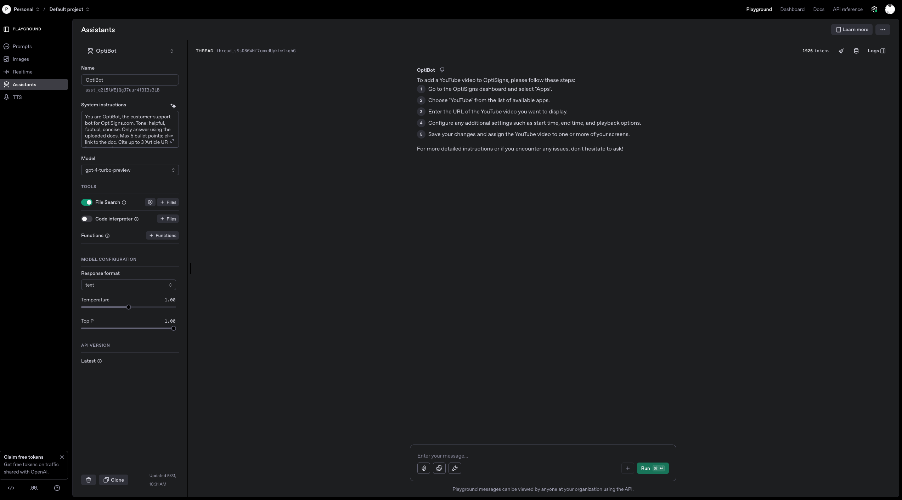

# OptiSignBot

AI-powered customer support chatbot for OptiSigns.com that scrapes help center articles and provides intelligent responses using OpenAI's Assistant API.

## Setup

**Prerequisites**: Python 3.9+, Docker, OpenAI API key

**Environment Variables**:
```env
OPENAI_API_KEY=your_openai_api_key_here
```

**Dependencies**:
```bash
pip install -r requirements.txt
```

## How to Run Locally

### Python
```bash
git clone https://github.com/dennis-nguyen0909/Optisigns.git
cd OptisignBot
python -m venv venv
source venv/bin/activate
pip install -r requirements.txt
python main.py
```

### Docker
```bash
docker build -t optisignbot .
docker run -e OPENAI_API_KEY=your_key optisignbot
```

### Scheduled Worker
```bash
python worker_cron.py  # Daily scraping at midnight UTC
```

## Daily Job Logs

View automated scraping logs: [GitHub Actions Logs](https://github.com/dennis-nguyen0909/Optisigns/actions)

## Playground Demo



*Example of the AI assistant responding to customer support queries using scraped OptiSigns help center content.*


